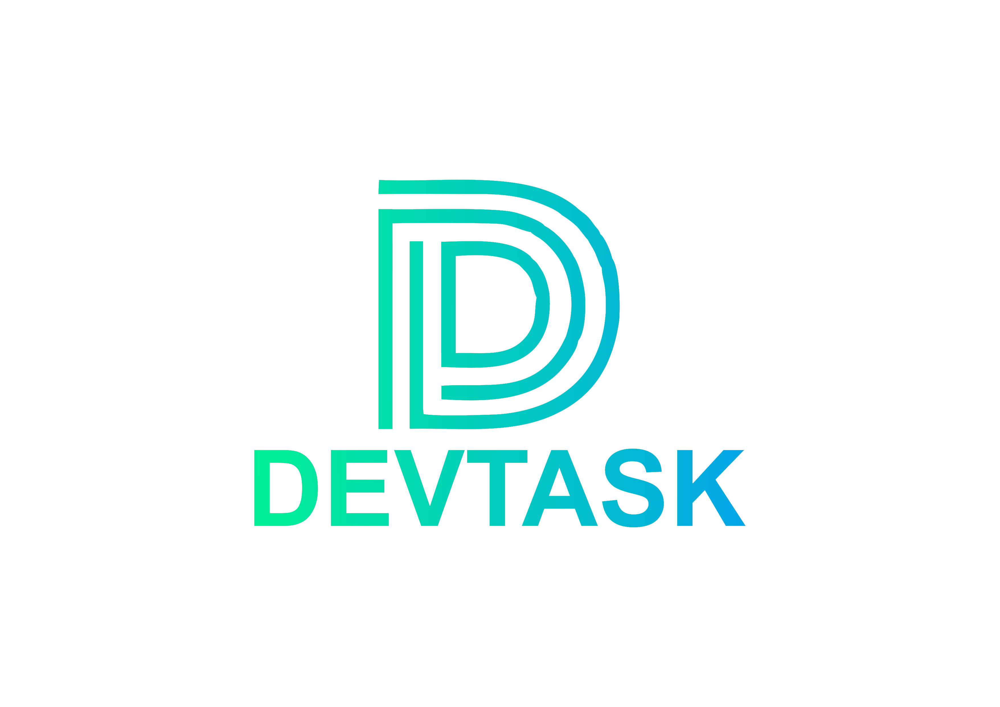

# DevTask

`Análise e Desenvolvimento de Sistemas`

`Eixo 1 - Projeto: Desenvolvimento de Aplicação Web Front-End`

`2023/2`

Gerenciador de tarefas para desenvolvedores de software
## Integrantes

* Tomaz Martins Pereira Pontes
* Bruno Almeida Silveira Bezerra
* Bruno Cândido Silva Almeida
* Jose Lucas dos Santos
* Nathan Vitorino Sergio Rocha
* Matheus Martins de Assis

## Orientador

Clóvis Lemos Tavares

# Documentação

<ol>
<li><a href="documentos/01-Documentação de Contexto.md"> Documentação de Contexto</a></li>
<li><a href="documentos/02-Especificação do Projeto.md"> Especificação do Projeto</a></li>
<li><a href="documentos/03-Metodologia.md"> Metodologia</a></li>
<li><a href="documentos/04-Projeto de Interface.md"> Projeto de Interface</a></li>
<li><a href="documentos/05-Template padrão da Aplicação.md"> Template padrão da Aplicação</a></li>
<li><a href="documentos/06-Programação de Funcionalidades.md"> Programação de Funcionalidades</a></li>
<li><a href="documentos/07-Plano de Testes de Software.md"> Plano de Testes de Software</a></li>
<li><a href="documentos/08-Registro de Testes de Software.md"> Registro de Testes de Software</a></li>
<li><a href="documentos/09-Referências.md"> Referências Bibliográficas</a></li>
</ol>

# Hospedagem

* <a href="https://icei-puc-minas-pmv-ads.github.io/pmv-ads-2023-2-e1-proj-web-t14-ProjDevTask/codigo-fonte/indexpage.html" target="_blank">DevTask</a>

# Código-Fonte

* <a href="codigo-fonte/README.md">Código Fonte</a>

# Apresentação

* <a href="apresentacao/README.md">Apresentação do Projeto</a>
